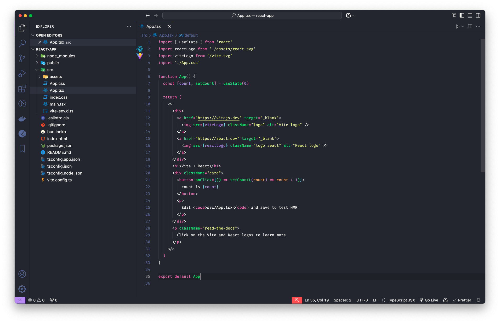

# Dracula Flat Theme

Dracula Flat is a dark theme for Visual Studio Code inspired by the [Dracula](https://github.com/dracula/visual-studio-code) color palette, with a flat design for a modern and clean look.

## Installation

1. Open the Extensions view in Visual Studio Code by clicking on the Extensions icon in the Activity Bar on the side of the window or by pressing `Ctrl+Shift+X`.
2. Search for "Dracula Flat".
3. Click "Install" to install the theme.
4. Once installed, go to `File > Preferences > Color Theme` and select "Dracula Flat" from the list.

## Features

- Dark theme with a flat design
- Inspired by the Dracula color palette

## Usage

1. Press `F5` to open a new window with your extension loaded.
2. Open the color theme picker with the `File > Preferences > Theme > Color Theme` menu item, or use the `Preferences: Color Theme` command (`Ctrl+K Ctrl+T`) and pick your theme.
3. Open a file that has a language associated. The languages' configured grammar will tokenize the text and assign 'scopes' to the tokens. To examine these scopes, invoke the `Developer: Inspect Editor Tokens and Scopes` command from the Command Palette (`Ctrl+Shift+P` or `Cmd+Shift+P` on Mac).

## Contributing

If you would like to contribute to this theme, please feel free to submit a pull request or open an issue on the [GitHub repository](https://github.com/nnsng/dracula-flat).

## License

This theme is licensed under the MIT License. See the [LICENSE](./LICENSE.txt) file for more information.
